# Tsunagu

保護者面談の日程調整を自動化する、学校向けスケジューリングシステムです。

既存の日程調整サービスは「先着順」が基本ですが、Tsunagu は **全家庭を必ず割り当てる** ことを前提に、「兄弟は連続した枠に」「特別支援学級は通常学級と連続した枠に」といった学校現場特有の制約を同時に満たすスケジューリングアルゴリズムを実装しています。現役小学校教員としての実務経験をもとに設計しました。

**登録不要、ワンクリックで教師・保護者（提出済み/提出前）・管理者の4ロールを試せます。** アプリのトップページにあるデモボタンから、実際の画面・操作をそのまま体験いただけます。

アプリケーションや実装内容は以下から確認できます。

- アプリケーション: https://tsunagu-app.com
- GitHub (フロントエンド): <https://github.com/yasuhiro-dev/tsunagu-frontend>
- GitHub (バックエンド): <https://github.com/yasuhiro-dev/tsunagu-backend>

## 目次

- [解決する課題](#解決する課題)
- [機能](#機能)
- [開発環境 (フロントエンド)](#開発環境-フロントエンド)
- [開発環境 (バックエンド)](#開発環境-バックエンド)
- [本番環境](#本番環境)
  - [インフラ構成図](#インフラ構成図)
- [ER図](#er図)
- [使用技術 (フロントエンド)](#使用技術-フロントエンド)
- [使用技術 (バックエンド)](#使用技術-バックエンド)
- [使用技術 (インフラ・その他)](#使用技術-インフラその他)
- [画面](#画面)
- [工夫した点](#工夫した点)
- [テスト・静的解析](#テスト静的解析)
- [各種リンク](#各種リンク)

## 解決する課題

学校現場では、保護者との個人面談の日程調整を教員が手作業で行っています。実際に現場で感じていた課題は次の通りです。

- **手作業での割り振りは大きな負担**：全家庭分の面談を、様々な条件を考慮しながら組み立てる必要がある
- **複数の担任との調整が必要な家庭がある**：兄弟が別クラス、または通常学級と特別支援学級に在籍している場合、担任同士で連続した時間帯に調整する必要がある
- **既存サービスは「先着順」が基本**：ITに不慣れな家庭や忙しい家庭が不利になりやすく、公平性に欠ける

Tsunagu は「全家庭を必ず割り当てる」「学校特有の制約条件を尊重する」という前提を置き、これらを同時に満たすスケジューリングアルゴリズムを軸に機能・データ設計を行っています。

## 機能

### 共通

- ログイン / ログアウト
- パスワードリセット（メールで再設定リンクを送信）
- ロール（保護者 / 教員 / 管理者）に応じて表示する画面・利用できるAPIを制限

### 保護者

- 児童の複数登録（兄弟・特別支援学級への在籍に対応）
- 面談不可日時の提出
- 確定した面談日時の確認
- 面談日時のGoogleカレンダー登録（Googleアカウント連携後、ワンクリックで追加）

### 教員

- **面談枠の自動割り当て**
- 未割当児童の一覧確認
- 個別の手動割り当て（未割当の家庭を教員が直接指定）
- 面談確定メールの自動送信（Gmail API / 新規割り当て時に保護者へ自動通知）
- 面談スケジュールのPDF出力
- Googleアカウント連携（OAuth 2.0）

### 管理者

- 教員・保護者アカウントの登録・編集・削除（検索 / 一括削除 / ページネーション）
- 面談枠の一括自動割り当て
- 提出締切日の設定
- クラス別の割り当て状況の可視化（グラフ）

## 開発環境 (フロントエンド)

フロントエンドは Next.js（TypeScript）で構築しています。面談枠の表示・割り当て結果の確認・保護者の面談不可日入力などの画面を担当します。

```
docker compose up -d
docker compose exec next_container npm install
docker compose exec next_container npm run dev
```

- URL: <http://localhost:3001>
- 開発言語: TypeScript
- フレームワーク: Next.js / React
- UIライブラリ: MUI

## 開発環境 (バックエンド)

バックエンドは Rails API mode で構築しています。認証、面談枠の自動割り当てロジック、PDF出力、Google連携（Gmail / カレンダー）などのAPIを提供します。

```
docker compose up -d
docker compose exec rails_container bundle install
docker compose exec rails_container bin/rails db:create db:migrate db:seed
```

- Rails API: <http://localhost:3000>
- DB: MySQL

## 本番環境

本番環境では、フロントエンド（Next.js）とバックエンド（Rails API）を別々の形で運用し、CloudFrontが1つのドメイン（`tsunagu-app.com`）への入り口となり、両者を繋いでいます。

- Next.js は静的サイトとしてビルドし、**S3** に置いて配信
- Rails API は Docker イメージ化し、**ECS Fargate** 上のコンテナとして実行
- **CloudFront** がパスベースルーティングで振り分け（`/api/*` → Rails API、それ以外 → Next.js）

- Route 53 - DNS
- ACM - HTTPS証明書
- CloudFront - CDN配信・パスベースルーティングによるフロント/バックエンドの振り分け
- S3 - Next.js静的ファイルの配置
- ALB - Rails APIへのリクエストをECS Fargateタスクへ分散
- ECS Fargate - Rails API のコンテナ実行
- Amazon RDS for MySQL - データベース
- ECR - Dockerイメージ管理
- GitHub Actions - CI/CD

### インフラ構成図

<!-- 構成図の画像を docs/images/readme/infrastructure.png のように配置してリンクしてください -->

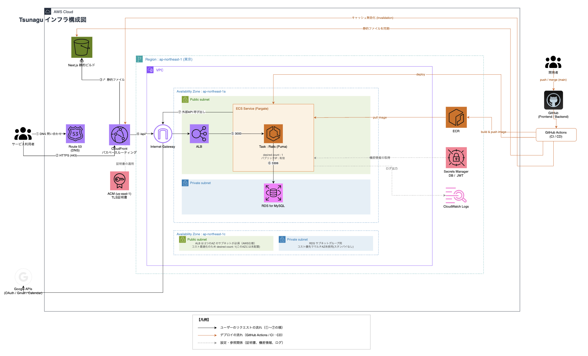

#### リクエストの流れ

1. ユーザーは独自ドメイン（`tsunagu-app.com`）にHTTPSでアクセスします。
2. リクエストはCloudFrontに届き、パスパターンによって振り分けられます。
3. `/api/*` にマッチするリクエストは、ALBを経由してRails API（ECS Fargate）に転送されます。
4. それ以外のリクエストは、S3に配置されているNext.jsの静的ファイルがそのまま返されます。

#### 外部連携

- RDS: ユーザー、児童、クラス、面談枠、割り当て結果などの保存・取得に利用します。
- Gmail API: リマインドメール送信に利用します。
- Google Calendar API: 保護者の面談日程をGoogleカレンダーへ登録する際に利用します。
- OAuth 2.0（Google）: 教員・保護者アカウントとGoogleアカウントの連携に利用します。

#### デプロイの流れ

`main` ブランチへの push を GitHub Actions が検知し、以下を実行します。

- フロントエンド: Next.jsを静的ビルドし、S3へアップロード
- バックエンド: Dockerイメージを ECR へ push したうえで、ECS Fargate サービスへデプロイ

いずれの場合もCloudFrontのキャッシュを適宜無効化（インバリデーション）し、最新の内容が反映されるようにしています。

## ER図

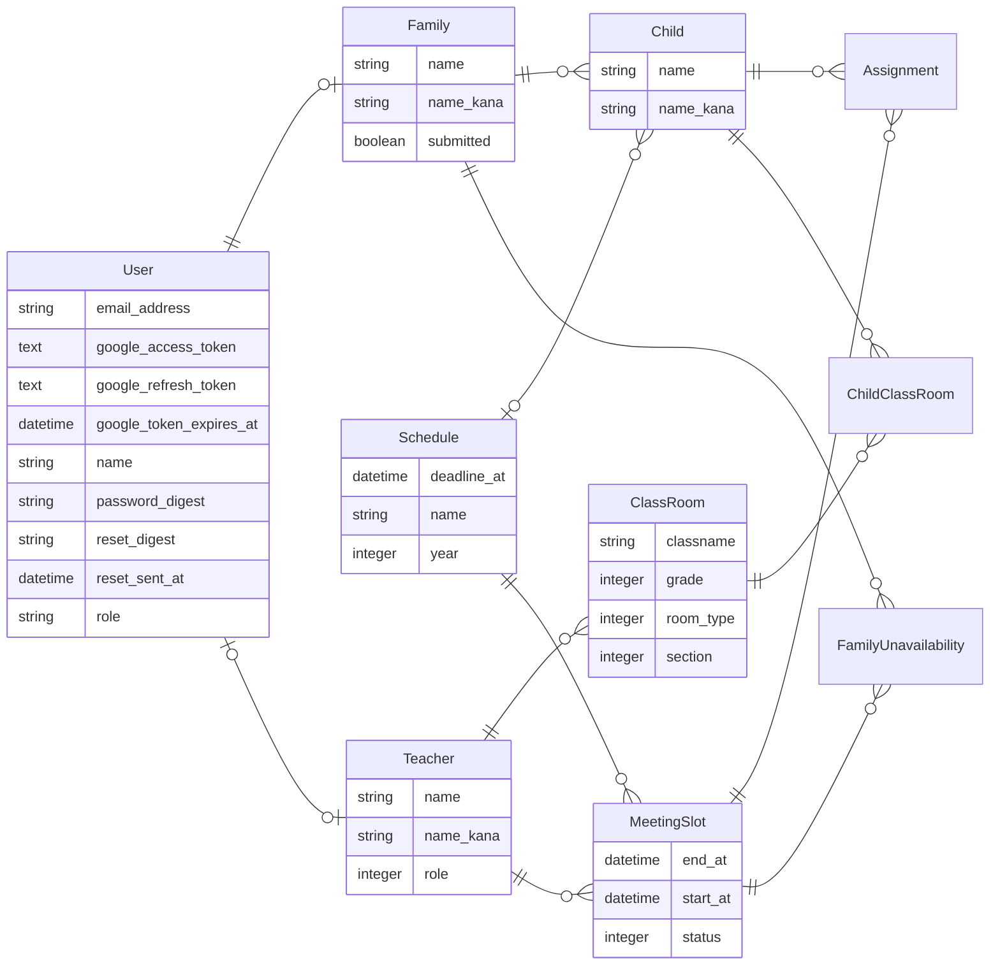

| テーブル                  | 役割                                                                           |
| ------------------------- | ------------------------------------------------------------------------------ |
| `users`                   | 認証情報。Googleカレンダー連携用のトークンも保持                               |
| `teachers`                | 教員のプロフィール情報                                                         |
| `families`                | 保護者のプロフィール情報                                                       |
| `children`                | 児童情報                                                                       |
| `class_rooms`             | クラス情報。担任の教員に紐づく                                                 |
| `child_class_rooms`       | 児童の所属クラス。複数クラスに所属できる（通常学級と特別支援学級の在籍に対応） |
| `schedules`               | 面談を実施する期間の設定                                                       |
| `meeting_slots`           | 面談枠。日時ごとに区切られた1コマ                                              |
| `assignments`             | 面談枠に割り当てられた児童の記録                                               |
| `family_unavailabilities` | 保護者が提出した面談不可の日時                                                 |

## 使用技術 (フロントエンド)

| 技術                                            | バージョン / 補足            |
| ----------------------------------------------- | ---------------------------- |
| [Next.js](https://nextjs.org/docs)              | 16.x                         |
| [React](https://react.dev/)                     | 19.x                         |
| [TypeScript](https://www.typescriptlang.org/)   | 5.x                          |
| [MUI](https://mui.com/)                         | v9                           |
| [MUI X Charts](https://mui.com/x/react-charts/) | 割当状況の可視化に使用       |
| fetch API                                       | APIリクエスト（Next.js標準） |
| [ESLint](https://eslint.org/)                   | 静的解析                     |

## 使用技術 (バックエンド)

| 技術                                                                             | バージョン / 補足               |
| -------------------------------------------------------------------------------- | ------------------------------- |
| [Ruby](https://www.ruby-lang.org/)                                               | 3.3.x                           |
| [Rails](https://rubyonrails.org/)                                                | 8.1.x / API mode                |
| [MySQL](https://www.mysql.com/) / [mysql2](https://github.com/brianmario/mysql2) | 8.0（本番：Amazon RDS）         |
| [jwt](https://github.com/jwt/ruby-jwt)                                           | 認証（自前実装、有効期限30分）  |
| [bcrypt](https://github.com/bcrypt-ruby/bcrypt-ruby)                             | パスワードのハッシュ化          |
| [oauth2](https://github.com/oauth-xx/oauth2)                                     | Google OAuth 2.0連携            |
| [Grover](https://github.com/Studiosity/grover)                                   | PDF生成（Puppeteer + Chromium） |
| [RSpec Rails](https://github.com/rspec/rspec-rails)                              | テスト                          |
| [RuboCop](https://rubocop.org/)                                                  | 静的解析                        |
| [Brakeman](https://brakemanscanner.org/)                                         | セキュリティ静的解析            |
| [bundler-audit](https://github.com/rubysec/bundler-audit)                        | 依存gemの脆弱性チェック         |
| [Gmail API](https://developers.google.com/gmail/api)                             | リマインドメール送信            |
| [Google Calendar API](https://developers.google.com/calendar)                    | 面談日程のカレンダー登録        |

## 使用技術 (インフラ・その他)

| 技術                                                                                                                     | 用途                                                  |
| ------------------------------------------------------------------------------------------------------------------------ | ----------------------------------------------------- |
| [Amazon S3](https://docs.aws.amazon.com/AmazonS3/latest/userguide/Welcome.html)                                          | Next.js 静的ファイルの配置                            |
| [AWS ECS Fargate](https://docs.aws.amazon.com/AmazonECS/latest/developerguide/AWS_Fargate.html)                          | Rails API のコンテナ実行                              |
| [ALB (Application Load Balancer)](https://docs.aws.amazon.com/elasticloadbalancing/latest/application/introduction.html) | Rails API へのリクエストをECS Fargateタスクへ分散     |
| [Amazon CloudFront](https://docs.aws.amazon.com/AmazonCloudFront/latest/DeveloperGuide/Introduction.html)                | CDN配信・パスベースルーティングによるS3/ALBの振り分け |
| [Amazon RDS for MySQL](https://docs.aws.amazon.com/AmazonRDS/latest/UserGuide/CHAP_MySQL.html)                           | 本番DB                                                |
| [Route 53](https://docs.aws.amazon.com/Route53/latest/DeveloperGuide/Welcome.html)                                       | DNS                                                   |
| [ACM](https://docs.aws.amazon.com/acm/latest/userguide/acm-overview.html)                                                | HTTPS証明書                                           |
| [ECR](https://docs.aws.amazon.com/AmazonECR/latest/userguide/what-is-ecr.html)                                           | Dockerイメージ管理                                    |
| [GitHub Actions](https://docs.github.com/en/actions)                                                                     | CI/CD                                                 |
| [Docker / Docker Compose](https://docs.docker.com/)                                                                      | 開発環境                                              |

## 画面

### トップページ

<!-- スクリーンショットを挿入 -->

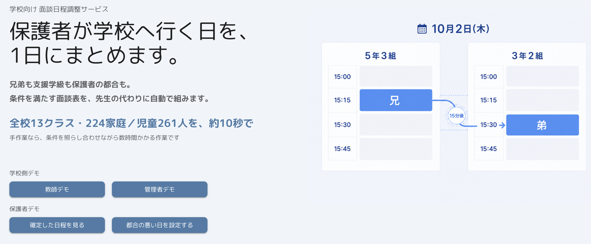

トップページでは、アプリの概要と主要導線が分かるようにしています。

### 認証

<!-- 2枚並べて挿入 -->

| 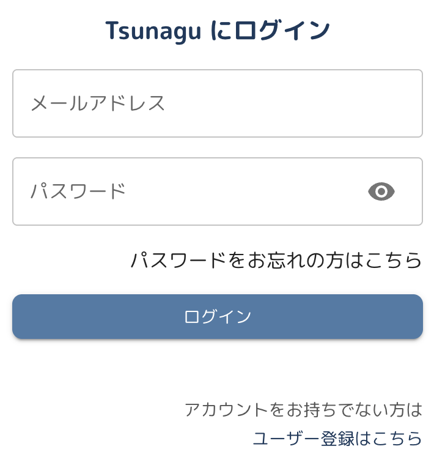 | 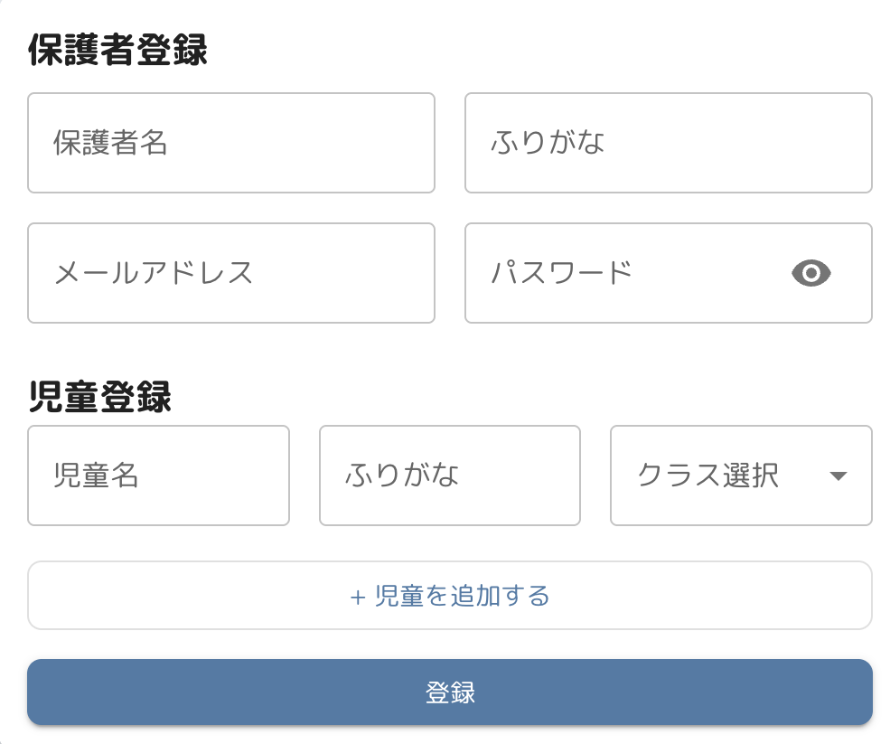 |
| -------------------------------------------------- | --------------------------------------------------- |
| ログイン                                           | 新規登録（児童の複数登録に対応）                    |

### 面談枠の自動割り当て

<!-- デモGIF・スクリーンショットを挿入 -->

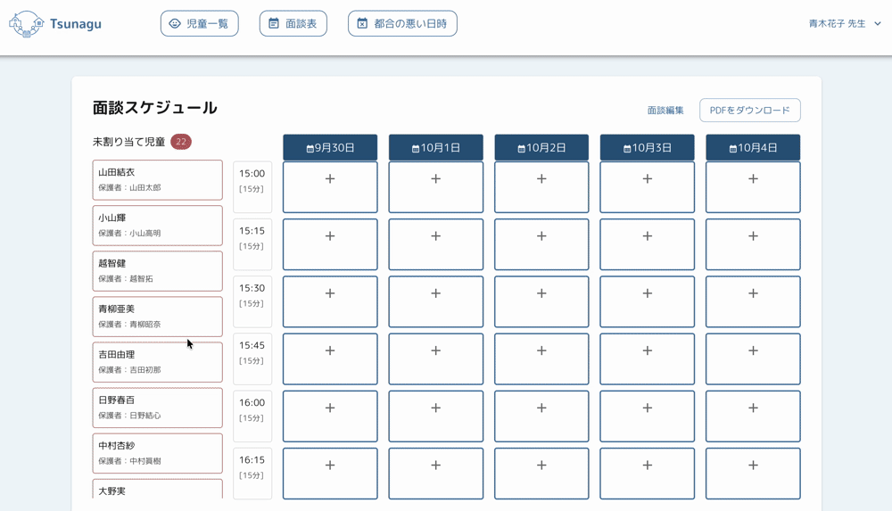

兄弟姉妹の連続配置・特別支援学級との調整など、制約条件を踏まえて面談枠を自動で割り当てます。

### 保護者の面談不可日提出

<!-- スクリーンショットを挿入 -->

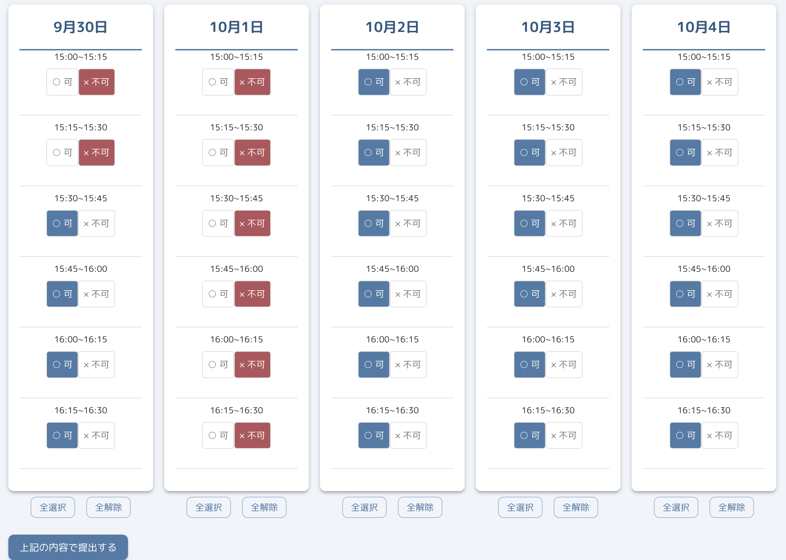

提示された面談枠のうち、都合の悪い枠をWeb上で選択して提出します。

### 確定した面談日程の確認

<!-- スクリーンショットを挿入 -->

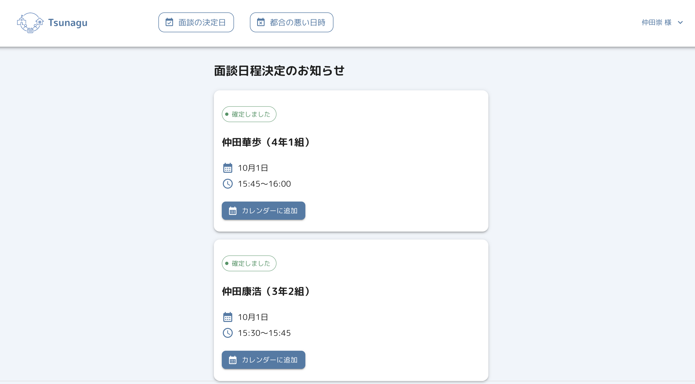

保護者が自分の子どもの面談日時を確認し、ワンクリックでGoogleカレンダーに登録できます。

### 面談表PDF出力

<!-- スクリーンショットを挿入 -->

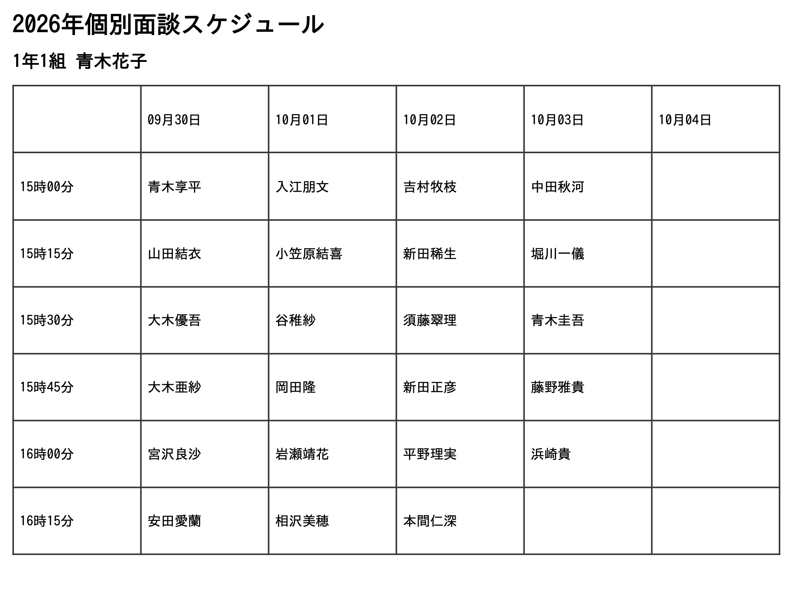

割り当て結果を、先生が確認・共有しやすいPDF形式で出力できます。

### 管理画面

<!-- ユーザー管理: 2枚並べて挿入 -->

| 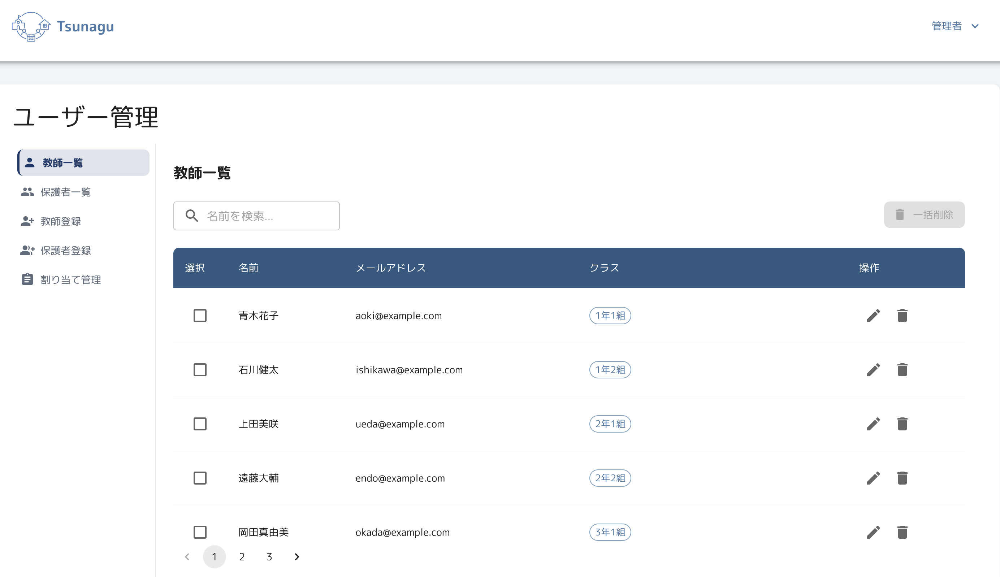 | 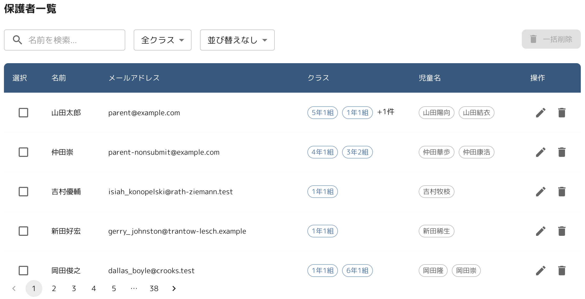      |
| ------------------------------------------------ | ------------------------------------------------------ |
| 教員アカウントの検索・一括削除                   | 保護者アカウントの検索・一括削除（クラス絞り込み対応） |

<!-- 割り当て状況の可視化 -->

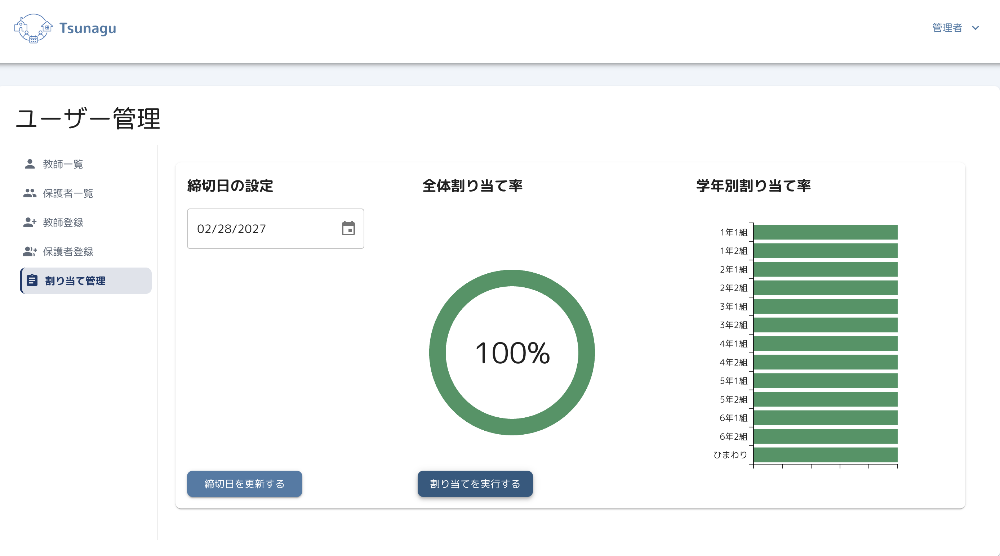

クラスごとの割り当て状況をグラフで確認できます。

### パスワードリセット

<!-- 3枚並べて挿入 -->

| 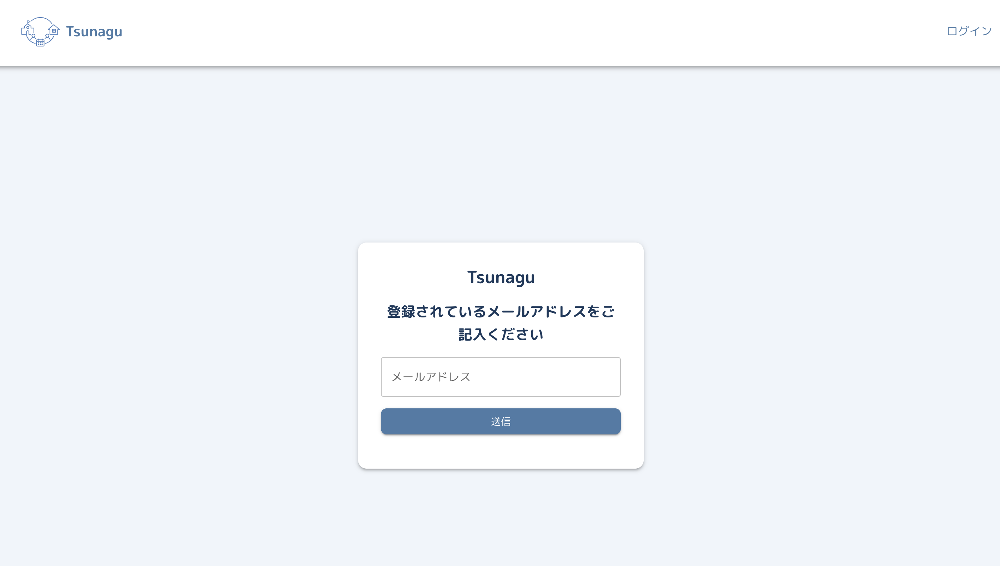 | 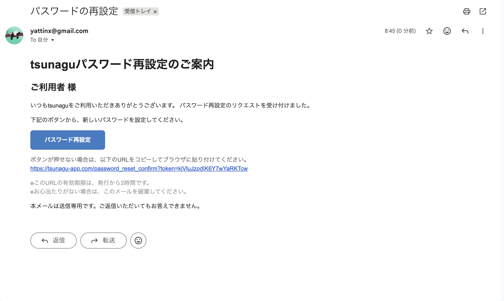 | 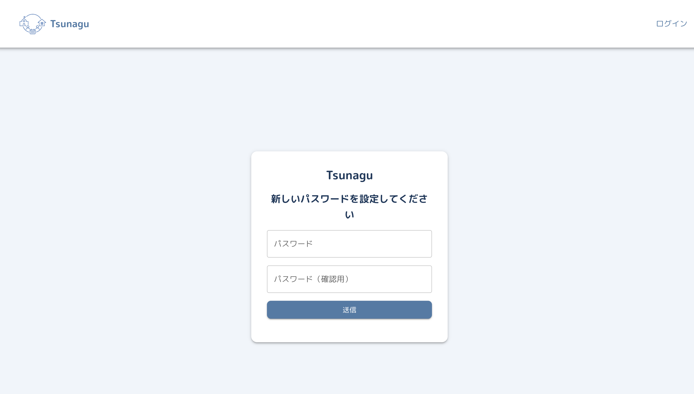 |
| ------------------------------------------------------------------ | ---------------------------------------------------------------- | ------------------------------------------------------------------ |
| メールアドレスを入力してリセットを申請                             | 届いたメールのリンクから遷移                                     | 新しいパスワードを設定して完了                                     |

## 工夫した点

### 1. 割り当てロジックの責務分割

面談枠の自動割り当ては、`ScheduleAssigner` を起点に、`GroupChildren` → `PrioritySort` → `AvailableSlots` → `TimeFilter` → `SiblingsFilter` → `SupportFilter` → `Assigner` の各クラスへ処理を委譲する構成にしています。1クラス1責務に分けることで、それぞれを独立してテストでき、条件の追加・変更にも対応しやすい設計にしています。

### 2. 制約の強さをスコア化した優先度制御

割り当てアルゴリズムは、次の4条件を同時に満たす必要があります。

- 限られた面談枠の中で、全家庭を必ず割り当てる
- 保護者が提出した面談不可日時には割り当てない
- 兄弟は連続した枠に配置する（例：兄が5年2組の枠 → 弟が3年2組の枠）
- 特別支援学級の児童は、通常学級の面談と連続した枠に配置する（例：3年1組の枠 → ひまわり学級の枠）

このうち兄弟・特別支援学級のように「連続した枠」を必要とする家庭は選べる枠が限られるため、後回しにすると割り当て不能になりやすい問題がありました。そこで制約の強さをスコア化し、スコアの高い家庭から順に枠を確保する方式を採用しています。

| 条件                   | スコア | 理由                                                                  |
| ---------------------- | :----: | --------------------------------------------------------------------- |
| 兄弟がいる             |   +4   | 連続2枠が必要。担任2人とも通常学級（30人前後）で空き枠が重なりにくい  |
| 特別支援学級を含む     |   +2   | 同じく連続2枠が必要だが、少人数学級のため兄弟のケースより選択肢は多い |
| 面談不可日時を提出済み |   +1   | 連続枠は不要だが、保護者側の都合で候補となる枠が減る                  |

合計スコアの降順で処理し、条件を満たす枠が見つからなかった家庭は割り当てをスキップして、教員が手動で最終調整します。

## テスト・静的解析

```
# Rails
docker compose exec rails env RAILS_ENV=test bundle exec rspec
docker compose exec rails bundle exec rubocop
docker compose exec rails bundle exec brakeman

# Next.js
docker compose exec next npm run lint
```

CIでは RSpec（22ファイル / リクエストスペック14・割り当てロジック8）、RuboCop、Brakeman、ESLint を実行しています。
割り当てロジックは8クラスすべてに個別のスペックを用意し、条件ごとの挙動を独立して検証しています。

## 各種リンク

- アプリケーション: https://tsunagu-app.com
- GitHub (フロントエンド): <https://github.com/yasuhiro-dev/tsunagu-frontend>
- GitHub (バックエンド): <https://github.com/yasuhiro-dev/tsunagu-backend>
