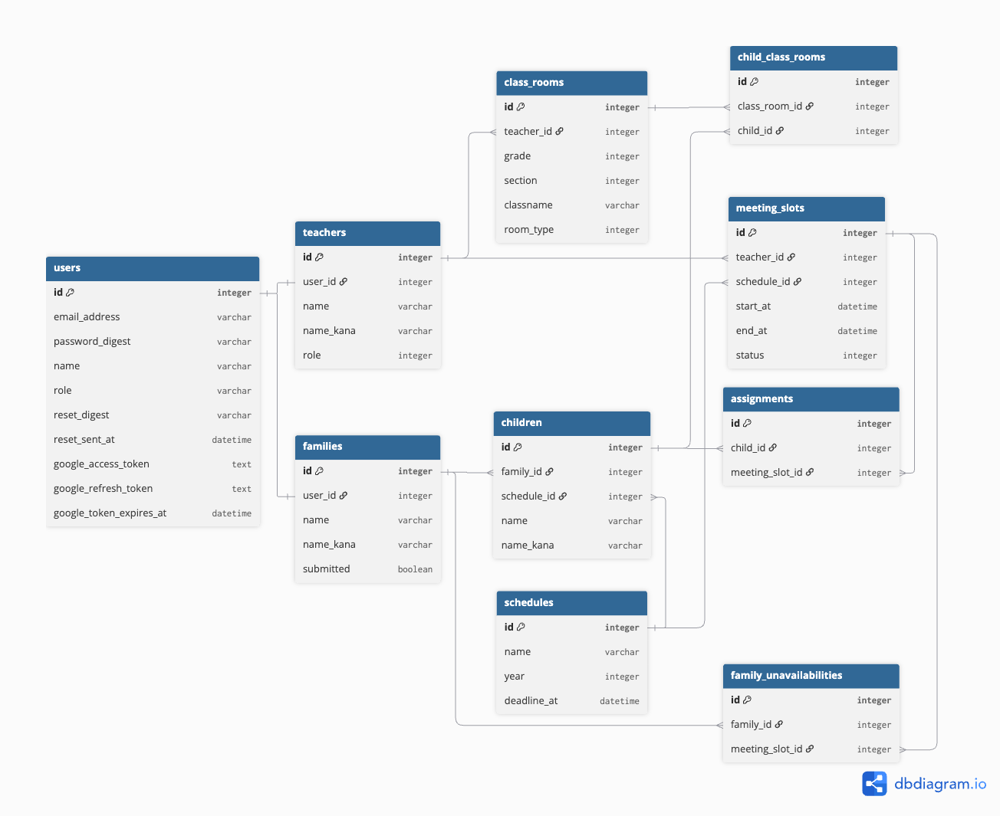

# Tsunagu

保護者面談の日程調整を自動化する、学校向けスケジューリングシステムです。

Tsunagu は **できる限り多くの家庭を自動で割り当てる** ことを目指し、
「兄弟は連続した枠に」「特別支援学級は通常学級と連続した枠に」といった
学校現場特有の制約を同時に満たすスケジューリングアルゴリズムを実装しています。現役小学校教員としての実務経験をもとに設計しました。

登録不要、ワンクリックで教師・保護者（確定した日程の参照/都合の悪い日の設定）・管理者の4ロールを試せます。

アプリケーションや実装内容は以下から確認できます。

- アプリケーション: https://tsunagu-app.com
- GitHub (フロントエンド): <https://github.com/yasuhiro-dev/tsunagu-frontend>
- GitHub (バックエンド): <https://github.com/yasuhiro-dev/tsunagu-backend>

**技術構成**: Next.js (TypeScript) / Rails 8 API mode / MySQL / AWS (ECS Fargate・S3・CloudFront・RDS) / Docker / GitHub Actions

## 目次

- [解決する課題](#解決する課題)
- [機能](#機能)
- [開発環境（ローカル）](#開発環境ローカル)
- [本番環境](#本番環境)
  - [インフラ構成図](#インフラ構成図)
- [ER図](#er図)
- [使用技術 (フロントエンド)](#使用技術-フロントエンド)
- [使用技術 (バックエンド)](#使用技術-バックエンド)
- [使用技術 (インフラ・その他)](#使用技術-インフラその他)
- [画面](#画面)
- [工夫した点](#工夫した点)
- [苦労した点・学んだこと](#苦労した点学んだこと)
- [テスト・静的解析](#テスト静的解析)
- [各種リンク](#各種リンク)

## 解決する課題

学校現場では、保護者との個人面談の日程調整を教員が手作業で行っています。Googleフォームなどの一般的な予約システムを使う学校もありますが、学校特有の条件までは対応しきれないのが実情です。

| 一般的な予約システム                                                                    | Tsunagu                                                                              |
| --------------------------------------------------------------------------------------- | ------------------------------------------------------------------------------------ |
| **兄弟の面談がバラバラの日に**<br>個別予約のため、時間が揃わない                        | **兄弟をまとめて配置**<br>自動で識別し、連続した時間に配置する                       |
| **保護者の都合の悪い日を伝えられない**<br>空き枠から選ぶ以外に方法がない                | **保護者・教員双方の都合を考慮**<br>提出された面談不可日時を避けて自動調整する       |
| **複数の教員との調整が大変**<br>支援学級の児童は通常学級にも在籍するため、面談が2回必要 | **複数の教員の面談も自動調整**<br>2人の担任・2回の面談も、連続した枠を確保する       |
| **早い者勝ちで不公平に**<br>予約が早い家庭だけが有利になる                              | **条件が多い家庭を優先**<br>兄弟・特別支援など、選べる枠が少ない家庭から先に確保する |

Tsunagu は「学校特有の制約条件を尊重しながら、できる限り多くの家庭を自動で割り当てる」ことを軸に、機能・データ設計を行っています。条件が重なって配置できなかった家庭は、エラーにせず一覧で教員に返し、手動で調整できるようにしています。

### 自動割り当ての動作


兄弟姉妹の連続配置・特別支援学級との調整など、制約条件を踏まえて面談枠を自動で割り当てます。

## 機能

### 共通

- ログイン / ログアウト
- パスワードリセット（メールで再設定リンクを送信）
- ロール（保護者 / 教員 / 管理者）に応じて表示する画面・利用できるAPIを制限

### 教員

- 児童一覧・未提出者の確認
- 未割当児童の一覧確認
- 個別の手動割り当て（未割当の家庭を教員が直接指定）
- 面談確定メールの自動送信（Gmail API / 新規割り当て時に保護者へ自動通知）
- 面談不可日時の登録（教員自身の対応できない日時をあらかじめ設定）
- 面談表のPDF出力
- Googleアカウント連携（OAuth 2.0）

### 保護者

- 児童の複数登録（兄弟・特別支援学級への在籍に対応）
- 面談不可日時の提出
- 確定した面談日時の確認
- 面談日時のGoogleカレンダー登録（Googleアカウント連携後、ワンクリックで追加）

### 管理者

- 教員・保護者アカウントの登録・編集・削除（検索 / 一括削除 / ページネーション）
- 面談枠の一括自動割り当て
- 提出締切日の設定
- クラス別の割り当て状況の可視化（グラフ）

## 開発環境（ローカル）

このリポジトリはドキュメント専用です。ローカルで動かすには、[フロントエンド](https://github.com/yasuhiro-dev/tsunagu-frontend)・[バックエンド](https://github.com/yasuhiro-dev/tsunagu-backend)の2リポジトリを、それぞれ `meeting_front` / `interview_app` というフォルダ名でこのリポジトリ直下にクローンしてください。

<details>
<summary>起動手順を見る</summary>

```bash
git clone https://github.com/yasuhiro-dev/tsunagu.git
git clone https://github.com/yasuhiro-dev/tsunagu-frontend.git tsunagu/meeting_front
git clone https://github.com/yasuhiro-dev/tsunagu-backend.git tsunagu/interview_app
```

バックエンドの起動には `RAILS_MASTER_KEY` が必要です。`config/master.key` がない場合、Google連携・メール送信機能は動作しません。

### フロントエンド

面談枠の表示・割り当て結果の確認・保護者の面談不可日入力などの画面を担当します。

```bash
docker compose up -d
docker compose exec next_container npm install
docker compose exec next_container npm run dev
```

- URL: <http://localhost:3001>

### バックエンド

認証、面談枠の自動割り当てロジック、PDF出力、Google連携（Gmail / カレンダー）などのAPIを提供します。

```bash
docker compose up -d
docker compose exec rails_container bundle install
docker compose exec rails_container bin/rails db:create db:migrate db:seed
```

- Rails API: <http://localhost:3000>

</details>

## 本番環境

本番環境では、フロントエンド（Next.js）とバックエンド（Rails API）を別々の形で運用し、CloudFrontが1つのドメイン（`tsunagu-app.com`）への入り口となり、両者を繋いでいます。

- Next.js は静的サイトとしてビルドし、**S3** に置いて配信
- Rails API は Docker イメージ化し、**ECS Fargate** 上のコンテナとして実行
- **CloudFront** がパスベースルーティングで振り分け（`/api/*` → Rails API、それ以外 → Next.js）

### 構成するAWSサービス

- Route 53 - DNS
- ACM - HTTPS証明書
- CloudFront - CDN配信・パスベースルーティングによるフロント/バックエンドの振り分け
- S3 - Next.js静的ファイルの配置
- ALB - Rails APIへのリクエストをECS Fargateタスクへ分散
- ECS Fargate - Rails API のコンテナ実行
- Amazon RDS for MySQL - データベース
- ECR - Dockerイメージ管理
- GitHub Actions - CI/CD

### インフラ構成図


_図をクリックすると拡大表示できます_

CloudFront がリクエストのパスを見て、`/api/*` は ALB 経由で Rails API（ECS Fargate）へ、それ以外は S3 上の Next.js 静的ファイルへ振り分けます。

### 外部連携

- Gmail API: リマインドメール送信に利用します。
- Google Calendar API: 保護者の面談日程をGoogleカレンダーへ登録する際に利用します。
- OAuth 2.0（Google）: 教員・保護者アカウントとGoogleアカウントの連携に利用します。

### デプロイの流れ

`main` ブランチへの push を GitHub Actions が検知し、以下を実行します。

- フロントエンド: Next.jsを静的ビルドし、S3へアップロード
- バックエンド: Dockerイメージを ECR へ push したうえで、ECS Fargate サービスへデプロイ

いずれの場合もCloudFrontのキャッシュを適宜無効化（インバリデーション）し、最新の内容が反映されるようにしています。

## ER図



| テーブル                  | 役割                                                                           |
| ------------------------- | ------------------------------------------------------------------------------ |
| `users`                   | 認証情報。Googleカレンダー連携用のトークンも保持                               |
| `teachers`                | 教員のプロフィール情報                                                         |
| `families`                | 保護者のプロフィール情報                                                       |
| `children`                | 児童情報                                                                       |
| `class_rooms`             | クラス情報。担任の教員に紐づく                                                 |
| `child_class_rooms`       | 児童の所属クラス。複数クラスに所属できる（通常学級と特別支援学級の在籍に対応） |
| `schedules`               | 面談を実施する期間の設定                                                       |
| `meeting_slots`           | 面談枠。日時ごとに区切られた1コマ                                              |
| `assignments`             | 面談枠に割り当てられた児童の記録                                               |
| `family_unavailabilities` | 保護者が提出した面談不可の日時                                                 |

## 使用技術 (フロントエンド)

| 技術                                                                 | バージョン / 補足            |
| -------------------------------------------------------------------- | ---------------------------- |
| [Next.js](https://nextjs.org/docs)                                   | 16.x                         |
| [React](https://react.dev/)                                          | 19.x                         |
| [TypeScript](https://www.typescriptlang.org/)                        | 5.x                          |
| [MUI](https://mui.com/)                                              | v9                           |
| [MUI X Charts](https://mui.com/x/react-charts/)                      | 割当状況の可視化に使用       |
| fetch API                                                            | APIリクエスト（Next.js標準） |
| [ESLint](https://eslint.org/)                                        | 静的解析                     |

## 使用技術 (バックエンド)

| 技術                                                                             | バージョン / 補足               |
| -------------------------------------------------------------------------------- | ------------------------------- |
| [Ruby](https://www.ruby-lang.org/)                                               | 3.3.x                           |
| [Rails](https://rubyonrails.org/)                                                | 8.1.x / API mode                |
| [MySQL](https://www.mysql.com/) / [mysql2](https://github.com/brianmario/mysql2) | 8.0（本番：Amazon RDS）         |
| [jwt](https://github.com/jwt/ruby-jwt)                                           | 認証（自前実装、有効期限30分）  |
| [bcrypt](https://github.com/bcrypt-ruby/bcrypt-ruby)                             | パスワードのハッシュ化          |
| [oauth2](https://github.com/oauth-xx/oauth2)                                     | Google OAuth 2.0連携            |
| [Grover](https://github.com/Studiosity/grover)                                   | PDF生成（Puppeteer + Chromium） |
| [RSpec Rails](https://github.com/rspec/rspec-rails)                              | テスト                          |
| [RuboCop](https://rubocop.org/)                                                  | 静的解析                        |
| [Brakeman](https://brakemanscanner.org/)                                         | セキュリティ静的解析            |
| [bundler-audit](https://github.com/rubysec/bundler-audit)                        | 依存gemの脆弱性チェック         |
| [Gmail API](https://developers.google.com/gmail/api)                             | リマインドメール送信            |
| [Google Calendar API](https://developers.google.com/calendar)                    | 面談日程のカレンダー登録        |
| [solid_queue](https://github.com/rails/solid_queue)                              | 非同期ジョブ（確認メール送信）  |

## 使用技術 (インフラ・その他)

| 技術                            | 用途                                                  |
| ------------------------------- | ----------------------------------------------------- |
| Amazon S3                       | Next.js 静的ファイルの配置                            |
| AWS ECS Fargate                 | Rails API のコンテナ実行                              |
| ALB (Application Load Balancer) | Rails API へのリクエストをECS Fargateタスクへ分散     |
| Amazon CloudFront               | CDN配信・パスベースルーティングによるS3/ALBの振り分け |
| Amazon RDS for MySQL            | 本番DB                                                |
| Route 53                        | DNS                                                   |
| ACM                             | HTTPS証明書                                           |
| ECR                             | Dockerイメージ管理                                    |
| GitHub Actions                  | CI/CD                                                 |
| Docker / Docker Compose         | 開発環境                                              |

## 画面

<details>
<summary>画面キャプチャを見る</summary>

### トップページ


### ログイン


### 新規登録


児童の複数登録に対応しています。

### 保護者の面談不可日提出


提示された面談枠のうち、都合の悪い枠をWeb上で選択して提出します。

### 確定した面談日程の確認


保護者が自分の子どもの面談日時を確認し、ワンクリックでGoogleカレンダーに登録できます。

### 面談表PDF出力


割り当て結果を、先生が確認・共有しやすいPDF形式で出力できます。

### 管理画面


教員アカウントの検索・一括削除


保護者アカウントの検索・一括削除（クラス絞り込み対応）


クラスごとの割り当て状況をグラフで確認できます。

### パスワードリセット


</details>

## 工夫した点

割り当て処理は、非同期化とN+1解消により実行時間を **約82秒から約8秒（約1/10）** に短縮しています。詳細は[苦労した点・学んだこと](#苦労した点学んだこと)に記載しています。

### 1. 割り当てロジックの責務分割

面談枠の自動割り当ては、`ScheduleAssigner` を起点に、`GroupChildren` → `PrioritySort` → `AvailableSlots` → `TimeFilter` → `SiblingsFilter` → `SupportFilter` → `Assigner` の各クラスへ処理を委譲する構成にしています。1クラス1責務に分けることで、それぞれを独立してテストでき、条件の追加・変更にも対応しやすい設計にしています。

### 2. 制約の強さをスコア化した優先度制御

割り当てアルゴリズムは、次の4条件を同時に満たす必要があります。

- 限られた面談枠の中で、できる限り多くの家庭を割り当てる
- 保護者が提出した面談不可日時には割り当てない
- 兄弟は連続した枠に配置する（例：兄が5年2組の枠 → 弟が3年2組の枠）
- 特別支援学級の児童は、通常学級の面談と連続した枠に配置する（例：3年1組の枠 → ひまわり学級の枠）

このうち兄弟・特別支援学級のように「連続した枠」を必要とする家庭は選べる枠が限られるため、後回しにすると割り当て不能になりやすい問題がありました。そこで制約の強さをスコア化し、スコアの高い家庭から順に枠を確保する方式を採用しています。

| 条件                   | スコア | 理由                                                                  |
| ---------------------- | :----: | --------------------------------------------------------------------- |
| 兄弟がいる             |   +4   | 連続2枠が必要。担任2人とも通常学級（30人前後）で空き枠が重なりにくい  |
| 特別支援学級を含む     |   +2   | 同じく連続2枠が必要だが、少人数学級のため兄弟のケースより選択肢は多い |
| 面談不可日時を提出済み |   +1   | 連続枠は不要だが、保護者側の都合で候補となる枠が減る                  |

合計スコアの降順で処理します。

### 3. 最後は人による日程の調節ができるようにする

割り当ては貪欲法で実装しています。優先度の高い家庭から順に枠を確定させ、一度決めた配置は後から変更しません。

配置に失敗したときに前の判断まで戻ってやり直す方式にすれば、より多くの家庭を配置できます。ただ実装が複雑になるため、今回の規模（児童261名・224家庭）では貪欲法で実用に足ると判断し、代わりに未割当への対応を用意する方針にしました。

条件が重なって配置できない家庭は必ず出ると考え、未割当をエラーにせず一覧で教員に返す形にしています。教員は残った家庭だけを見て、手動で枠を決められます。

## 苦労した点・学んだこと

### 割り当てが失敗してしまう不具合

面談自動割り当てボタンを押しても、一部の児童が割り当てられず、未割り当てになってしまう状態がありました。まずはタイポや実装ミスを疑い、フロントエンド・バックエンド双方のコードを確認しましたが、明確なエラーは見つかりませんでした。次に、どのパターンで失敗するのかを切り分けたところ、面談枠を2つ必要とする家庭は割り当てに成功する一方、3つ必要とする家庭のみ失敗していることが分かり、面談枠の割当ロジックを担当するサービスクラス（`SiblingsFilter`：兄弟の連続配置、`SupportFilter`：特別支援学級の連続配置）に当たりをつけました。ログを仕込んで中間データを確認したところ、`SiblingsFilter` が返す枠の並びと、`SupportFilter` が前提とする並び条件が噛み合っていないことが原因だと判明しました。`SiblingsFilter` 側で特別支援学級の枠が兄弟の通常学級枠と連続するよう条件を追加した結果、割り当ては安定し、問題を解消することができました。

この経験から、単独ファイルの中だけで実装を考えるのではなく、フィルタをまたいだ処理の流れ全体で条件を統一し、一貫性を持たせておくことの必要性を学びました。

### 割当処理のレスポンス速度改善（solid_queue による非同期化と N+1 解消）

面談自動割り当てを実行すると、完了までに約82秒かかる状態でした。CloudWatch のログを確認すると、1回のリクエストで4,453件もの SQL クエリが発行されており、該当箇所のコードで N+1 問題を調査していたところ、同じ処理の中で確認メール送信も呼ばれていることに気づきました。実際に仮のメールアドレスで受信を確認したところ、メールの受信に時間がかかっていることが分かり、外部API（Gmail API）への同期呼び出しが原因の一つではないかと考えました。原因を整理すると、①確認メール送信が割当処理と同じリクエスト内で同期的に実行されていたこと、②`includes` 済みの関連に `.where` や `.pluck` をチェーンしたことで事前読み込みが無効化され、N+1 が発生していたこと、の2点でした。まず確認メール送信を solid_queue で非同期化したところ約82秒から約10秒まで短縮され、その後 `.where` を `find { }` に、`.pluck` を `.map` に置き換え、事前読み込み済みのデータから取得する形にしたことで、約10秒から約8秒までさらに短縮されました。

この経験から、外部APIへの通信は結果をすぐ必要としない処理なら非同期化できること、そして `includes` は書いた時点で安心せず、後続で `.where` や `.pluck` をチェーンしていないか確認する必要があることを学びました。

## テスト・静的解析

```bash
# Rails
docker compose exec rails_container env RAILS_ENV=test bundle exec rspec
docker compose exec rails_container bundle exec rubocop
docker compose exec rails_container bundle exec brakeman

# Next.js
docker compose exec next_container npm run lint
```

CI では、バックエンドで RSpec（22ファイル / リクエストスペック13・サービススペック8・メーラースペック1）・RuboCop・Brakeman・bundler-audit を、フロントエンドで ESLint・型チェック（npm run build）・npm audit を実行しています。
割り当てロジックは8クラスすべてに個別のスペックを用意し、条件ごとの挙動を独立して検証しています。

## 各種リンク

- アプリケーション: https://tsunagu-app.com
- GitHub (フロントエンド): <https://github.com/yasuhiro-dev/tsunagu-frontend>
- GitHub (バックエンド): <https://github.com/yasuhiro-dev/tsunagu-backend>
